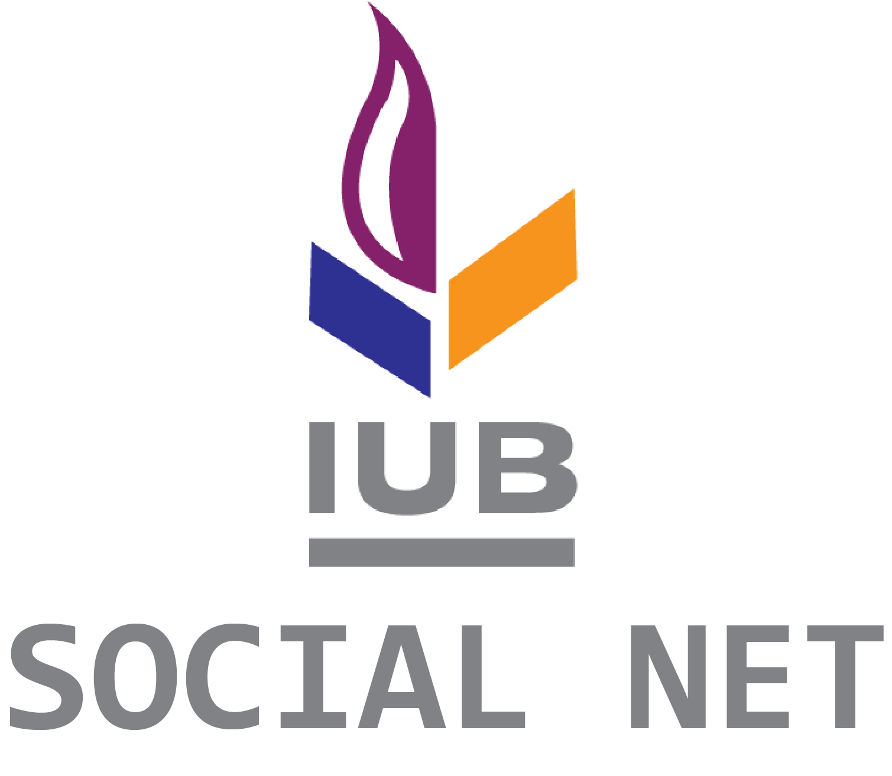

# **PROJECT NAME - 'IUB SOCIAL NET'**

## **PROJECT DEVELOPED BY - GROUP-19**

## **PROJECT INTRODUCTION**
#### **IUB SOCIAL NET** is an under development social networking website for the students of **Independent University, Bangladesh (IUB)**. It will be a common place for the faculties and students both to communicate seamlessly between eachother.

## **PROJECT DOCUMENTAION**
### Coming Soon!

## **HOW TO SETUP**
#### 1. Install Node.js and MongoDB on your computer.

#### 2. Download this code, and from command prompt run:
        npm install

        npm init

        npm install socket.io@2.4.1 bcrypt ejs express express-formidable fs http jsonwebtoken mongodb

        npm install -g nodemon

#### 3. To run the code, run:

        nodemon server.js

#### 4. In the browser open http://localhost:3000/, and you should see the index page